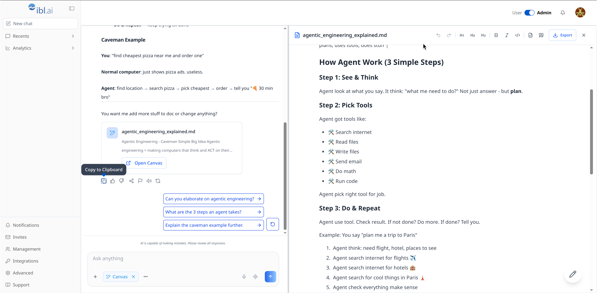
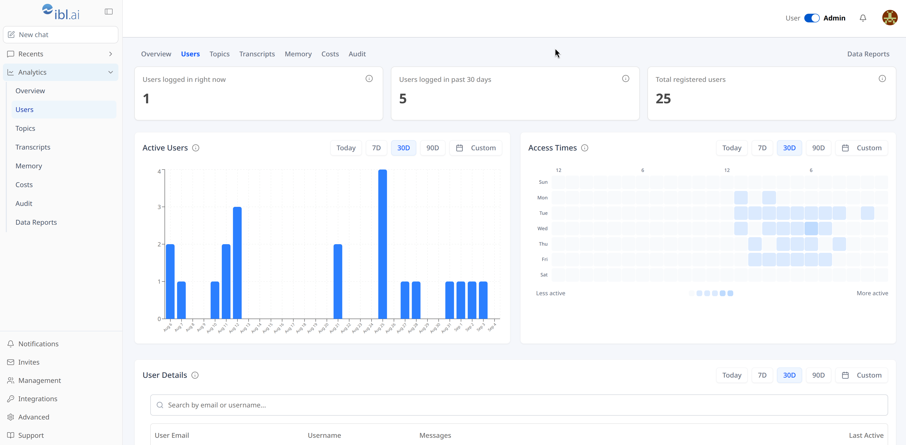

<div align="center">

<a href="https://ibl.ai"></a>

# vibe-agent

**One creator, one AI agent, one paywall.**

A single-platform app on ibl.ai: users sign in with ibl.ai SSO and chat with one agent, and access to the chat is sold on the platform's own Stripe account. Built from [iblai/vibe](https://github.com/iblai/vibe)'s `vibe-starter` template on the [@iblai/iblai-js](https://www.npmjs.com/package/@iblai/iblai-js) SDK.

[](https://nextjs.org)
[](https://www.typescriptlang.org)
[](https://tailwindcss.com)
[](https://claude.ai)
[](https://github.com/iblai/vibe/blob/main/skills/iblai-vibe-ops-build/SKILL.md)

</div>

---

## What is vibe-agent

<!-- Once deployed: "vibe-agent is deployed at [<host>](https://<host>)." -->

vibe-agent fronts one agent for one platform on [ibl.ai](https://ibl.ai). A creator (the platform admin) points it at an agent built on [os.ibl.ai](https://os.ibl.ai), decides whether access is free or paid, and members sign in with SSO to chat. Two kinds of users: **platform admins** (the creator and their staff) bypass the paywall, see Analytics in Admin mode and answer the one setup question; **members** pay on `/paywall` only when the admin chose a fee, and chat on `/`. Everything is the SDK's — the shell, the chat, the analytics, the profile and account panels — connected to [iblai.app](https://iblai.app).

## Screenshots

| Screen                         |                                                                         |
| ------------------------------ | ----------------------------------------------------------------------- |
| **Chat, with the canvas open** |  |
| **Analytics · Users**          |                |

## Features

| Feature               | Description                                                                                                                                                                                                                                                                                                                                                                                                                                                                                                                                                                     |
| --------------------- | ------------------------------------------------------------------------------------------------------------------------------------------------------------------------------------------------------------------------------------------------------------------------------------------------------------------------------------------------------------------------------------------------------------------------------------------------------------------------------------------------------------------------------------------------------------------------------- |
| **Chat**              | `/` — the SDK `Chat` with the one agent (`NEXT_PUBLIC_DEFAULT_AGENT_ID`): streaming, sessions, files, voice. Paying users and platform admins.                                                                                                                                                                                                                                                                                                                                                                                                                                  |
| **Sidebar**           | The SDK `PlatformSidebar` — the shell the ibl.ai OS and LMS use — with this app's content: **New chat**, **Recents** (pinned chats first; each row can be pinned, unpinned or deleted) and, for admins in Admin mode, the **Analytics** menu. The bottom-left cluster is the SDK's: Notifications and Support for everyone, plus Invites, Management, Integrations, Monetization (when the platform sells credits) and Advanced for admins in Admin mode; the last four open the platform's account sheet in place. Collapses to an icon rail (Cmd/Ctrl+B), a drawer on phones. |
| **Analytics**         | `/analytics/*` — the OS analytics section for this one agent: Overview, Users, Topics, Transcripts, Memory, Costs, Audit, Data Reports (SDK `AnalyticsLayout` + stats components). Platform admins, in Admin mode.                                                                                                                                                                                                                                                                                                                                                              |
| **Paywall**           | `/paywall` — pricing page, Stripe Checkout on the platform's own Stripe account, restore access. The platform owns entitlement; free access never needs a Stripe key.                                                                                                                                                                                                                                                                                                                                                                                                           |
| **Setup**             | `/setup` — one question: free access, one-time fee or monthly fee (USD); the Stripe product and price are created for you. Opens itself for a platform admin until answered; reachable later from the quiet "Payments setup" link on `/account`.                                                                                                                                                                                                                                                                                                                                |
| **User / Admin mode** | Platform admins get a User / Admin switch in the navbar (in the profile menu on narrow screens). User mode shows the app as a member sees it; Analytics and the admin cluster exist only in Admin mode. Starts on Admin, resets on reload.                                                                                                                                                                                                                                                                                                                                      |
| **Profile**           | `/profile` — the SDK `Profile` panel, from the profile dropdown.                                                                                                                                                                                                                                                                                                                                                                                                                                                                                                                |
| **Account**           | `/account` — the SDK `Account` panel (organization settings), admins.                                                                                                                                                                                                                                                                                                                                                                                                                                                                                                           |
| **Notifications**     | `/notifications` — the SDK notification centre, from the bell.                                                                                                                                                                                                                                                                                                                                                                                                                                                                                                                  |
| **About**             | `/about` — off by default; `NEXT_PUBLIC_SHOW_ABOUT=true` enables it. The agent's public profile plus your copy (`ABOUT_COPY` in `app/(app)/about/page.tsx`).                                                                                                                                                                                                                                                                                                                                                                                                                    |
| **Branding**          | The logo in the sidebar header (and in the navbar on phones) is the org logo set in the platform's org settings, falling back to the ibl.ai mark.                                                                                                                                                                                                                                                                                                                                                                                                                               |
| **SSO**               | Login via iblai.app — no tokens to manage. Every origin the app runs on must be in the platform's allowed redirect origins.                                                                                                                                                                                                                                                                                                                                                                                                                                                     |

The paywall boundary is the route group: everything under `app/(app)/(paid)/` renders inside `PaywallGate`. `/paywall` must stay outside that group or the gate loops. Platform admins bypass the gate.

## AGENTS.md / CLAUDE.md

`AGENTS.md` (with `CLAUDE.md` as its symlink) is the guide for agents and people changing this app: the map, the invariants and why, the paywall and setup end to end, and the gotchas learned building it. Read it before touching the shell, the paywall or the SDK wrappers.

## Quick Start

### Prerequisites

- Node.js 20 or newer (22 is what this app is built with) and pnpm
- An ibl.ai platform (org key) and a Platform API Token — sign up at [ibl.ai/join](https://ibl.ai/join)
- An agent created on [os.ibl.ai](https://os.ibl.ai): its uuid is the last path segment of `https://os.ibl.ai/platform/<platform-key>/<agent-uuid>`

### Install & Run

With a coding agent (Claude Code, opencode…), say `clone https://github.com/iblai/vibe-agent and start the server`: it asks whether you are a platform admin ([ibl.ai/join](https://ibl.ai/join) makes you one), then for the platform key and the agent uuid, writes `iblai.env` and `.env.local`, and starts the dev server (the procedure is in `AGENTS.md`). By hand:

1. Platform credentials go in `iblai.env` (gitignored):

   ```bash
   cp iblai.env.example iblai.env
   ```

   `PLATFORM` is your org key (listed on https://login.iblai.app/me); `TOKEN` is a Platform API Token.

2. App env goes in `.env.local`:

   ```bash
   cp .env.example .env.local
   ```

   Fill `NEXT_PUBLIC_MAIN_TENANT_KEY` (= `PLATFORM`), `IBLAI_API_KEY` (= `TOKEN`) and `NEXT_PUBLIC_DEFAULT_AGENT_ID` (the agent uuid). The API, auth and websocket URLs default to hosted iblai.app in `lib/iblai/config.ts`. The platform comes from that env var only: a missing or placeholder key shows an alert instead of an app, and a platform left in localStorage by another vibe app on the same origin is ignored.

3. Install and run:

   ```bash
   pnpm install --ignore-scripts
   pnpm dev
   ```

   Open http://localhost:3000 and sign in. Every origin the app runs on (localhost and the deployed one) must be in the platform's allowed redirect origins, or sign-in never comes back.

### Build

```bash
pnpm build
pnpm start
```

## Paywall

The platform (DM) owns entitlement: it mints Stripe Checkout sessions on the platform's own Stripe key, records payments, and checks subscriptions live. No Stripe Connect, no commission, no webhooks. The app has the server routes under `app/api/paywall/`, one client gate (`components/paywall-gate.tsx`), the pricing page (`app/paywall/`) and the setup screen (`app/setup`, `components/setup/setup-screen.tsx`). The buyer-side routes are the `/iblai-vibe-monetization-app-paywall` skill from `iblai/vibe`; the setup screen and the setup route are this app's.

Setup is one question, asked of a platform admin the first time they open the app (and reachable later from the quiet "Payments setup" link on `/account`):

- **Free access** — anyone signed in can use the agent. No Stripe needed, ever.
- **One-time fee** or **Monthly fee** — enter the price (USD). The first time, a second screen ("Monetize Your Agent") asks for a **restricted** Stripe key (Stripe → Developers → API keys → Create restricted key: write on Products, Prices, Checkout Sessions, Customers; read on Subscriptions). It is saved as the platform's `stripe` integration credential on the platform, browser to platform; this app's server never sees it.

For a paid answer, Save creates the Stripe product (named after the platform, tagged `metadata.app = PAYWALL_APP_SLUG`, which is what the platform checks at checkout) and the price, retires the previous price if the answer changed, and records the choice in the platform's metadata under `apps.<PAYWALL_APP_SLUG>`. Free records the choice and touches Stripe not at all; a price left behind by a paid → free switch stays active on Stripe but is never sold, since the app sells only the recorded one:

```json
{
  "apps": {
    "vibe-agent": {
      "access": "monthly",
      "amount": 2900,
      "currency": "usd",
      "stripe": { "product_id": "prod_…", "price_id": "price_…" },
      "updated_at": "…"
    }
  }
}
```

That metadata is a **public read** on the platform (ids and amounts only, never a key), so the deployed app needs no extra credential to know what it sells. Runtime rule (`lib/paywall.ts`): `PAYWALL_PRICE_IDS`, if set, is what the app sells; otherwise the recorded choice; free or unanswered means everyone gets in. Test with card `4242 4242 4242 4242`. Cancellations bite within the DM cache (about 75 s) plus up to 60 s of client grant cache.

Headless alternative, with `DOMAIN`, `PLATFORM`, `TOKEN` and `IBLAI_USERNAME` from `iblai.env`:

```bash
PAY="https://api.$DOMAIN/dm/api/ai-mentor/orgs/$PLATFORM/users/$IBLAI_USERNAME/providers/stripe/payments"
AUTH="Authorization: Api-Token $TOKEN"

curl -s -H "$AUTH" "$PAY/products/?limit=1"
# 200 connected · 400 no `stripe` credential · 502 Stripe rejected the key · 404 backend too old

curl -s -H "$AUTH" -H 'Content-Type: application/json' -X POST "$PAY/products/" \
  -d '{"name":"vibe-agent access","metadata":{"app":"vibe-agent"}}'

curl -s -H "$AUTH" -H 'Content-Type: application/json' -X POST "$PAY/prices/" \
  -d '{"product":"prod_…","unit_amount":2900,"currency":"usd","recurring":{"interval":"month"}}'
# drop "recurring" for a one-time price

curl -s -H "$AUTH" "$PAY/paywall/payments/?app=vibe-agent"   # who paid so far
```

Then `PAYWALL_PRICE_IDS=price_xxx,price_yyy` in `.env.local`: the pricing page describes env-listed prices from Stripe itself.

## Deployment

`/iblai-vibe-ops-deploy` (from `iblai/vibe`) zips the source, uploads it to ibl.ai hosting with the platform token, polls until ready and returns the live URL. It regenerates `.env.production` from `.env.local`; confirm it carries `IBLAI_API_KEY` and `PAYWALL_APP_SLUG` (plus `PAYWALL_PRICE_IDS` if you use the override), or the paywall routes 500 in production. Server mode is required: never set `output: 'export'`. Afterwards:

- add the deployed origin to the platform's allowed redirect origins;
- put it in `src-tauri/tauri.conf.json` → `build.frontendDist` (see below).

## Native apps (Tauri v2)

`src-tauri/` is a thin WebView shell: `tauri dev` loads `http://localhost:3000` and release builds load `build.frontendDist`, the deployed origin. Nothing is bundled, so there is no static export and the paywall's server routes keep working. Until `frontendDist` holds a real URL it points at a `.invalid` host on purpose, so a forgotten value fails loudly instead of shipping a blank app.

Prerequisites: [rustup](https://rustup.rs), `pnpm install --ignore-scripts`, and nothing else on port 3000. Linux also needs `libwebkit2gtk-4.1-dev build-essential libssl-dev libgtk-3-dev libayatana-appindicator3-dev librsvg2-dev`; Windows needs the Visual Studio Build Tools C++ workload and WebView2; macOS needs `xcode-select --install`.

```bash
pnpm exec tauri icon path/to/logo.png   # every icon size from one square PNG (1024 px recommended)
pnpm exec tauri dev                     # desktop, this OS
pnpm exec tauri build                   # desktop release: .dmg/.app, .exe/.msi, .deb/.AppImage
```

iOS (macOS with Xcode):

```bash
rustup target add aarch64-apple-ios aarch64-apple-ios-sim
pnpm exec tauri ios init
pnpm exec tauri ios dev "iPhone 16 Pro Max"   # device names: xcrun simctl list devices
pnpm exec tauri ios build                     # .ipa under src-tauri/gen/apple/build/
```

Android (Android Studio with SDK and NDK):

```bash
rustup target add aarch64-linux-android armv7-linux-androideabi i686-linux-android x86_64-linux-android
pnpm exec tauri android init
pnpm exec tauri android dev "Pixel_9"         # device names: adb devices
pnpm exec tauri android build                 # APK; add --aab for the Play Store
```

Mobile SSO cannot return from an `https://` page into a native app, so it comes back through the custom scheme: `TAURI_CUSTOM_SCHEME=vibe-agent` in `iblai.env`, mapped to `NEXT_PUBLIC_TAURI_CUSTOM_SCHEME` in the deployed env.

Signed desktop releases: copy `desktop-signing.env.example` to `desktop-signing.env`, then `make -f desktop-release.mk macos-dmg` (signed and notarized universal DMG) or `make -f desktop-release.mk windows-nsis`. `.github/workflows/tauri-build-desktop.yml` builds unsigned macOS, Windows and Linux artifacts on demand (Actions → Run workflow). The signed release workflows that trigger on `app-v*` tags are in `/iblai-vibe-ops-build`'s `assets/tauri/workflows/`.

Stores: `/iblai-vibe-ops-release` generates a Makefile and Fastlane config (`make ios-release`, `make android-release`); `/iblai-vibe-windows-msix` packages an MSIX for the Microsoft Store. A binary locked to one platform: `IBL_TENANT=<key> pnpm exec tauri build`.

## Releases

Releases are automated with [release-it](https://github.com/release-it/release-it), the way the OS does it. Every push to `main` runs `.github/workflows/release.yml`: it reads the conventional commit subjects since the last tag, bumps the version in `package.json` (`feat:` minor, `fix:` patch, a `!` or a `BREAKING CHANGE` footer major, anything else patch), prepends the entries to `CHANGELOG.md`, commits `chore(release): vX.Y.Z`, tags `vX.Y.Z` and publishes a GitHub Release with the same notes. The release commit is skipped by the workflow, so there is no loop. Only typed subjects reach the changelog, which is what the commitlint hook in `.husky/commit-msg` enforces. The first release, made while no `v*` tag exists, is 1.0.0.

Nothing to configure: the job releases with the built-in `GITHUB_TOKEN`, so the release commit, the tag and the GitHub Release show as `github-actions[bot]`. Pushes made with that token never trigger other workflows; a workflow that must run on the `v*` tag would need a personal access token instead, as the OS uses.

Never edit `CHANGELOG.md` or the `package.json` version by hand. `pnpm release` is for CI; locally use `pnpm release --dry-run --git.pushRepo=<remote>` to preview (release-it expects `origin`). The desktop shell is versioned on its own: `src-tauri/tauri.conf.json` is set by hand and built on demand, see above.

## Testing

| Command                                | Does                                                                                                                          |
| -------------------------------------- | ----------------------------------------------------------------------------------------------------------------------------- |
| `pnpm dev`, `pnpm build`, `pnpm start` | Next.js with Turbopack. `next build` type-checks with the project-local TypeScript 7 `tsc`                                    |
| `pnpm typecheck`                       | `oxlint --type-check` (tsgo diagnostics)                                                                                      |
| `pnpm lint`, `pnpm check`              | `oxlint --type-aware`; lint plus typecheck                                                                                    |
| `pnpm fmt`, `pnpm fmt:check`           | oxfmt                                                                                                                         |
| `pnpm test`                            | vitest (config, source paths, platform resolution, paywall helpers, platform-metadata store, route handlers, chat-row labels) |
| `pnpm test:e2e`                        | Playwright against real SSO (credentials in `e2e/.env.development`)                                                           |

Run `pnpm check`, `pnpm test` and `pnpm build` before a pull request; `pnpm test:e2e` when you change a user journey.

TypeScript is installed twice on purpose: `typescript` is aliased to the TS 6 package (the JavaScript compiler API Next.js loads) and `@typescript/native` to TS 7, so `tsc` is the Go compiler and `tsc6` the old one. That is the setup from [vercel/next.js#95633](https://github.com/vercel/next.js/discussions/95633); Next 16.3 runs the local `tsc` during `next build` by default (`experimental.useTypeScriptCli`, see `node_modules/next/dist/docs`).

## Project Structure

```
app/
├── layout.tsx                          # Root layout — wraps everything in <IblaiProviders>
├── (app)/
│   ├── layout.tsx                      # Signed-in shell: SDK SidebarProvider + PlatformSidebar + navbar, one scroller
│   ├── (paid)/                         # Behind <PaywallGate>
│   │   ├── page.tsx                    # Chat — SDK <Chat> (?session= restores, ?new= starts fresh)
│   │   └── analytics/                  # SDK <AnalyticsLayout> over eight pages
│   ├── about/  profile/  account/  notifications/[[...id]]/
├── paywall/                            # Pricing page, checkout hand-off, return page (outside the gate)
├── setup/                              # The one setup question (outside the shell, no navbar)
├── sso-login-complete/                 # SSO landing
└── api/paywall/
    ├── access/  checkout/  prices/     # Buyer rail — this server as the buyer, with IBLAI_API_KEY
    └── admin/setup/                    # Admin rail — forwards the admin's own platform token
components/
├── sidebar/                            # app-sidebar.tsx (PlatformSidebar wrapper), recent-chats.tsx, chat-row.tsx, flat-nav-row.tsx
├── navbar/                             # nav-bar.tsx, logo.tsx, user-profile-button.tsx, admin-mode-switch.tsx
├── setup/setup-screen.tsx              # The question, then the Stripe key screen
├── paywall-gate.tsx                    # Client gate for (paid)
├── loading-screen.tsx                  # The one loading / busy screen (OS look)
└── plan-card.tsx
lib/
├── paywall.ts  paywall-admin.ts        # Server-only: platform calls, platform-metadata store, catalogue
├── paywall-client.ts                   # Browser side: token header, catalogue fetch, setup checks
├── chat-rows.ts                        # Recents row labels
└── iblai/                              # config.ts (env), tenant.ts, admin-mode.tsx, auth-utils.ts, storage-service.ts
providers/iblai-providers.tsx           # initializeDataLayer + AuthProvider + TenantProvider + i18n
store/iblai-store.ts                    # Redux store (slice keys fixed by the SDK)
proxy.ts                                # CSP and the 404 for /about when the flag is off
src-tauri/                              # Thin WebView shell for desktop and mobile
.github/workflows/                      # release.yml (release-it on every push to main), tauri-build-desktop.yml (desktop bundles on demand)
.husky/commit-msg                       # commitlint
```

## Built With

- [Next.js](https://nextjs.org) — App Router, Turbopack
- [@iblai/iblai-js](https://www.npmjs.com/package/@iblai/iblai-js) — SDK for auth, the shell, chat, analytics, profile and account
- [Tailwind CSS](https://tailwindcss.com) — utility-first styling with ibl.ai design tokens
- [shadcn/ui](https://ui.shadcn.com) — accessible UI primitives (base-nova)
- [Tauri v2](https://tauri.app) — native desktop and mobile shells
- [iblai.app](https://iblai.app) — the platform: auth, agents, entitlement, analytics

## Contributing

### Setup

1. Clone the repo
2. Install dependencies: `pnpm install --ignore-scripts`
3. `pnpm husky` once: the install skips `prepare`, so the commit-msg hook (commitlint) is not there otherwise
4. Fill `iblai.env` and `.env.local` (see Quick Start), then `pnpm dev`

### Development Workflow

1. Create a branch from `main`: `git checkout -b feat/my-feature`
2. Make your changes; `pnpm fmt` the files you touched
3. Run `pnpm check`, `pnpm test` and `pnpm build`
4. Commit with a conventional subject (`feat:`, `fix:`, `docs:`, `chore:`… — commitlint checks it; it decides the next version and the changelog) and push your branch
5. Open a pull request against `main`

### Guidelines

- **Use ibl.ai SDK components first** — do not build custom components when an SDK equivalent exists; shadcn/ui (`pnpm dlx shadcn@latest add <component> -y`) for everything else
- **Host SDK panels the way the OS does** — full width, no card, the component's own background; read `AGENTS.md` before wrapping one
- **Do not override SDK styles** — SDK components ship with their own styling
- **Never set `output: 'export'`** — the paywall needs the server routes
- **`IBLAI_API_KEY` and `PAYWALL_*` are server-only** — never `NEXT_PUBLIC_`, never read outside route handlers; secrets never go into platform metadata
- **A new env key lands in `.env.example` and this README** in the same change; a new route lands with a test in `__tests__/`
- **Use `pnpm`** as the package manager

### Adding Features

Use the [iblai/vibe](https://github.com/iblai/vibe) skills with Claude Code:

```
/iblai-vibe-auth          # SSO authentication (already wired)
/iblai-vibe-agent-chat    # Agent chat (already wired)
/iblai-vibe-profile       # Profile page (already wired)
/iblai-vibe-account       # Account/org settings (already wired)
/iblai-vibe-analytics     # Analytics dashboard (already wired)
/iblai-vibe-notification  # Notification centre (already wired)
/iblai-vibe-invite        # Invite dialogs
/iblai-vibe-ops-deploy    # Deploy to ibl.ai hosting
/iblai-vibe-ops-build     # Desktop/mobile builds
/iblai-vibe-ops-upgrade   # Upgrade SDK and skills
```

See `AGENTS.md` for the full list and the component priority rules.

## Resources

- [ibl.ai Documentation](https://ibl.ai/docs)
- [Vibe](https://github.com/iblai/vibe) — developer toolkit for building with ibl.ai
- [@iblai/mcp](https://www.npmjs.com/package/@iblai/mcp) — MCP server for AI-assisted development
- [iblai-app-cli](https://github.com/iblai/iblai-app-cli) — CLI for scaffolding ibl.ai apps
- [ibl.ai/os](https://github.com/iblai/os) — the open-source agent platform this app mirrors
- [HQ](https://github.com/iblai/hq) — sister app for org / profile / analytics management

---

<sub>Built with <a href="https://github.com/iblai/vibe">ibl.ai Vibe</a></sub>
