# Sell access to your AI agent: the vibe-agent tutorial

> **Being rewritten.** The app now asks its own setup questions — you press
> **Start** in the browser and answer the platform, the agent, the app's name
> and the price there. Chapter 1's table of things Claude asks for, and the
> first screenshots of Part 1, are from the older flow where Claude asked them
> in the chat. Everything from chapter 3 on still holds.

You have an agent on ibl.ai. By the end of this tutorial it has its own web app: people sign up, pay you on your own Stripe account, and talk to it. You write no code. Whenever something technical is needed, you tell Claude Code what you want and it does it.

The example throughout is **Search Craft**, an SEO school. Its agent, **Search Craft Coach**, teaches site owners to get found, and access costs $29.90 a month. Swap in your own platform, agent and price.

## Watch it first

### [▶ Part 1 — the owner sets it up](https://drive.google.com/file/d/1Z2R9TszJsKUQfOhwWykRuFEgX1qnkRTO/view)

### [▶ Part 2 — a customer's first visit](https://drive.google.com/file/d/16tZ40BUhRerb4QGP2TLWOlmePVz1O3U9/view)

Two screen recordings, chapters 1–6 and chapter 7 below.

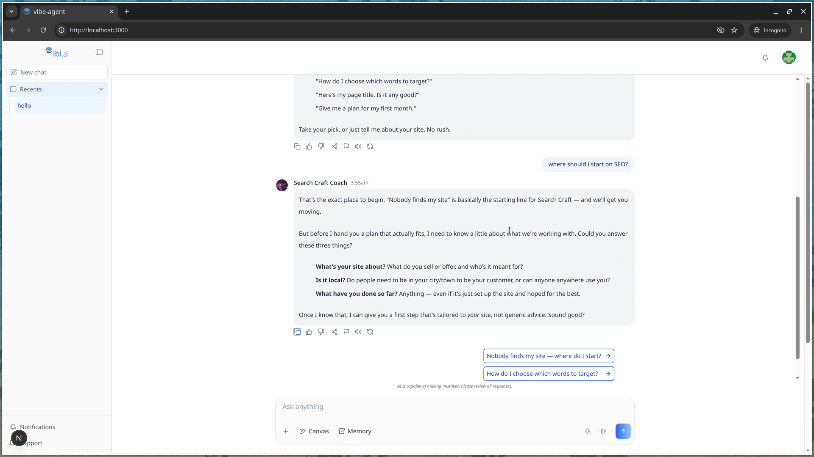

_Where you end up: a customer, paid up, getting a plan from the coach._

An hour or so, most of it waiting for things to install.

## What you need

**An ibl.ai account with a platform of your own.** A platform is your space on ibl.ai: your agents, your people, your sign-in page. Make one at https://ibl.ai/join — it creates the account and the platform together, free. Every account also belongs to a shared platform called `main`; that one is everyone's, not yours, and the app refuses it.

**An agent.** Build one at https://os.ibl.ai (inside your platform, Explore → Create Agent), or just have a name and one line about what it does — Claude can create it for you.

**A Stripe account**, only if you charge. Open one at https://stripe.com. Free access needs nothing.

**Claude Code**, Anthropic's assistant that works in a terminal, and a Claude subscription (Pro, Max, Team or Enterprise). Install it:

- Mac or Linux: open the Terminal app (on a Mac it is in Applications → Utilities), paste this line and press Enter:
  ```
  curl -fsSL https://claude.ai/install.sh | bash
  ```
- Windows: open PowerShell (search for it in the Start menu), paste this line and press Enter:
  ```
  irm https://claude.ai/install.ps1 | iex
  ```

Then type `claude` and press Enter. The first time, it opens your browser so you can sign in. That window — a prompt where you type to Claude — is where the rest of this tutorial happens. If the install gives you trouble, the official guide is https://code.claude.com/docs/en/quickstart.

**The one habit that makes this work.** Whenever Claude says something is missing — Node, pnpm, a skill, anything with a technical name — reply:

> **Say to Claude:** `install what's missing and continue`

You never need to know what those things are.

## 1. Get the app running

In the Claude window, say:

> **Say to Claude:** `get https://github.com/iblai/vibe-agent`

Claude downloads the app and follows the instructions inside it. It asks you for a few things, one at a time, in this order. Have them ready:

| Claude asks for          | Where it is                                                                                                                                                                                                                                                                                                                                                                                                                                                                                                      |
| ------------------------ | ---------------------------------------------------------------------------------------------------------------------------------------------------------------------------------------------------------------------------------------------------------------------------------------------------------------------------------------------------------------------------------------------------------------------------------------------------------------------------------------------------------------- |
| **Your platform key**    | Open https://login.iblai.app/me. Each platform you belong to is listed with its key, a short word like `searchcraft`. Never `main` — that is the shared one. No platform of your own yet? Make one at https://ibl.ai/join, then come back and answer.                                                                                                                                                                                                                                                            |
| **A Platform API Token** | In https://os.ibl.ai, with your platform showing at the top left: switch the **User / Admin** toggle (top right) to Admin, open **Integrations** at the bottom of the left sidebar, choose the **APIs** tab, press **Add API**. Name it `vibe-agent`, leave the expiry empty, leave Owner permissions selected, Submit. The key is shown once: copy it and paste it into the Claude window. Claude puts it away at once, uses it to look up your agent and, later, to publish the app, and never shows it again. |
| **Your agent**           | Open the agent in https://os.ibl.ai and copy the address from the browser bar: `https://os.ibl.ai/platform/<your key>/<a long id>`. Paste it. No agent yet? Say so, give a name and one line about what it does, and Claude creates it.                                                                                                                                                                                                                                                                          |
| **A name for the app**   | Claude suggests one from the agent — "Call the app Search Craft Coach?" Say yes, or give the name you want. It is what the browser tab and the Stripe receipt call the app.                                                                                                                                                                                                                                                                                                                                      |

Then Claude installs what the app needs, starts it, and tells you to open **http://localhost:3000** in your browser. That address is the app running on your own computer; only you can see it for now.

If Claude downloads the app and stops there, say `follow CLAUDE.md`.

## 2. Sign in as the owner

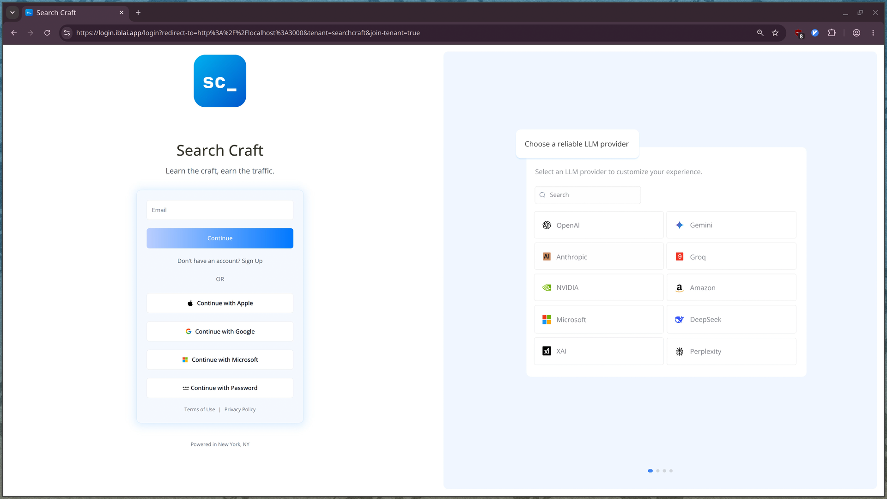

_Your platform's name, line and logo, as set for your platform in the OS. Sign in the way you like._

Opening http://localhost:3000 sends you to ibl.ai's sign-in page for your platform. Sign in with the account that owns the platform — Google, Apple, Microsoft or a password, whichever you set it up with. Because that account is the platform's admin, you come back into the app on its one setup question.

## 3. Decide how people get in

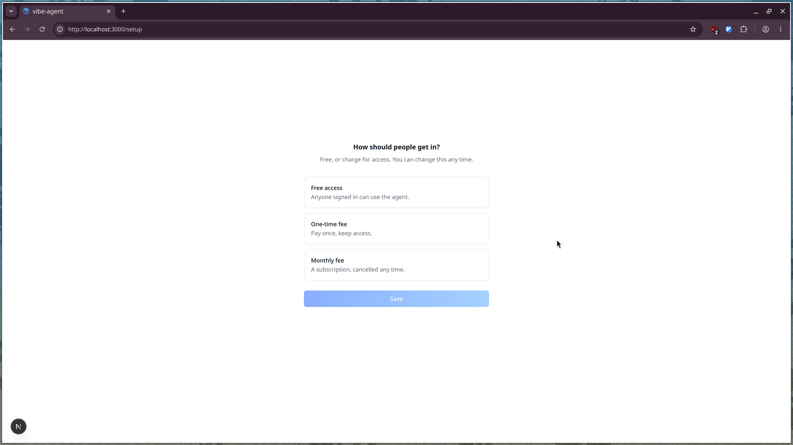

_Three answers. Free needs no Stripe, ever._

- **Free access** — anyone who signs in can use the agent. Choose it, press Save, and you are done: you land in the chat.
- **One-time fee** — pay once, keep access. A price box appears; enter it in US dollars.
- **Monthly fee** — a subscription, cancelled any time. Enter the monthly price. Search Craft charges 29.90.

You can change this any time (chapter 6 shows where). Press Save. For a paid answer, one more screen comes first.

## 4. Connect Stripe (paid only)

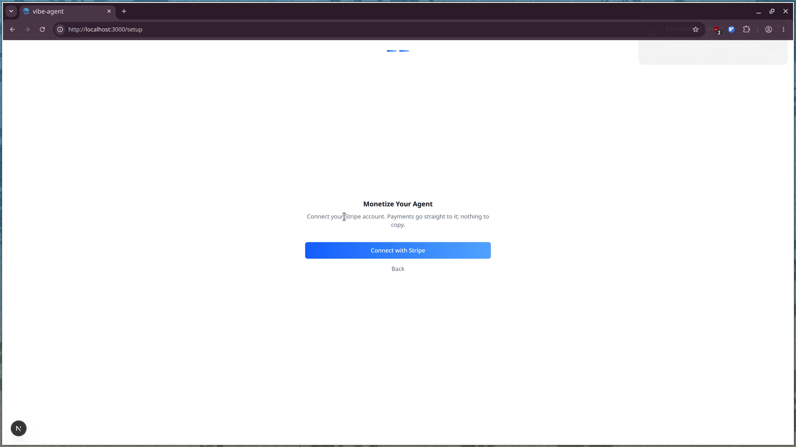

_One button. Nothing to copy, nothing to type._

Press **Connect with Stripe**. Stripe opens and asks which of your Stripe accounts to connect to ibl.ai — pick one, or make a new one right there.

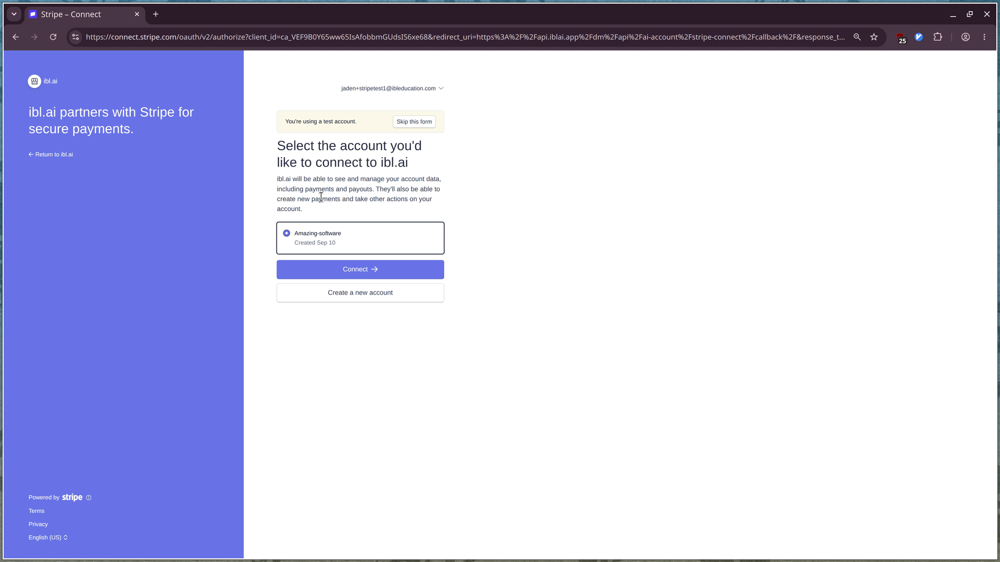

_Choose the account and press Connect. "You're using a test account" means no real money will move — good for trying this out._

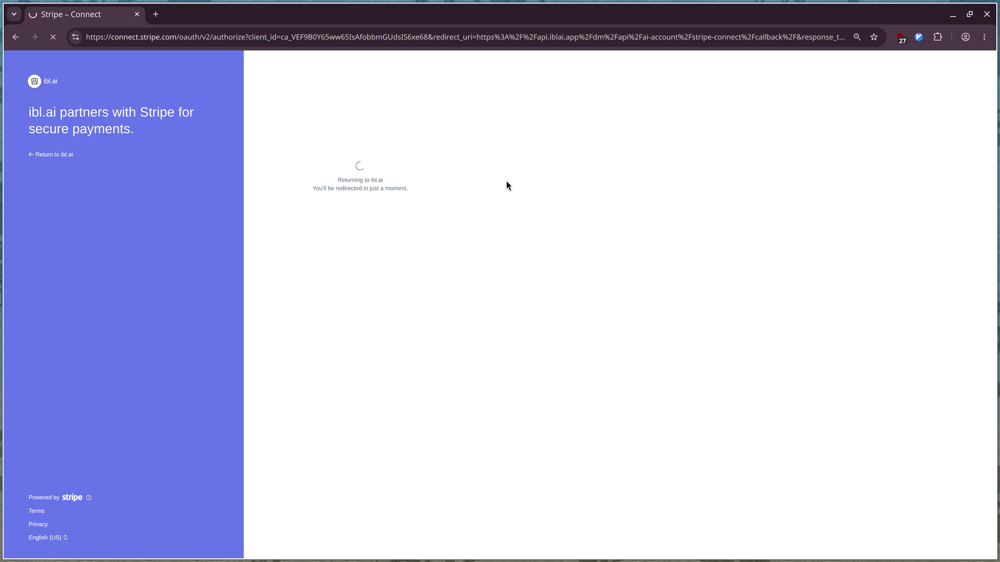

_Stripe sends you straight back. The answer you gave saves itself on the way in._

That is the whole payment setup. Customers pay on Stripe's own form, the money goes into the Stripe account you just connected, and ibl.ai takes no fee.

**Test or real?** If you connected a test account, everything a customer sees is marked TEST MODE and Stripe's test card works (chapter 7). When you are ready for real money, come back to this screen (chapter 6 shows the way) and use **Reconnect**, the quiet link under Save, to connect your live account instead.

## 5. Meet your agent

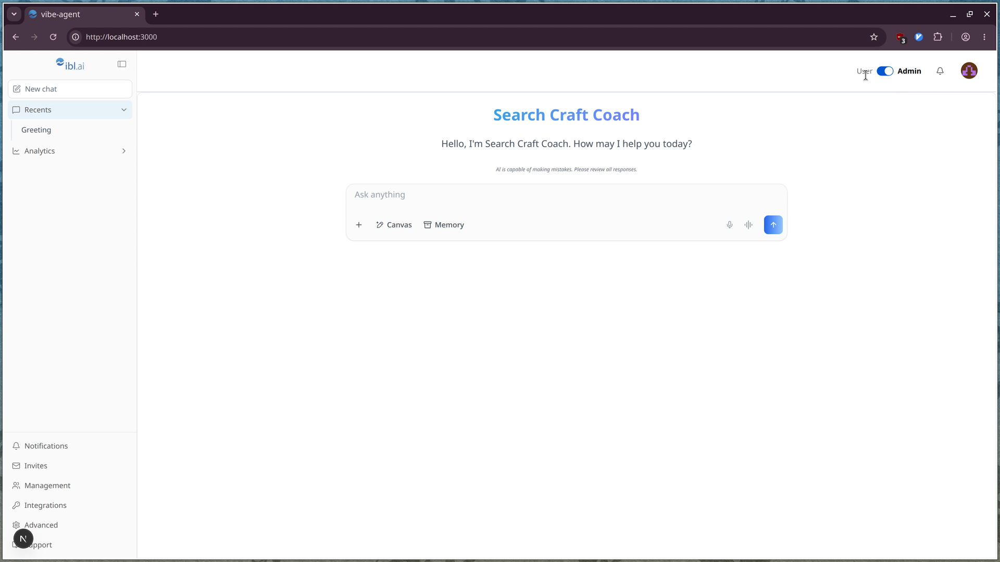

_Your agent's name and greeting, the chat box, and — because you are the admin — Analytics and the admin tools in the sidebar._

The switch at the top right, **User / Admin**, is yours alone. Admin shows you Analytics (who talks to the agent, about what, and what it costs) and the platform's tools at the bottom of the sidebar. User shows you exactly what your customers get:

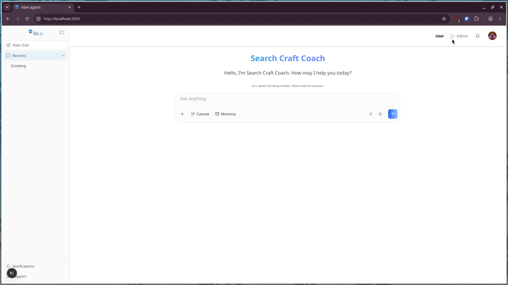

_What a customer sees: the chat, their recent conversations, Notifications and Support._

Say hello.

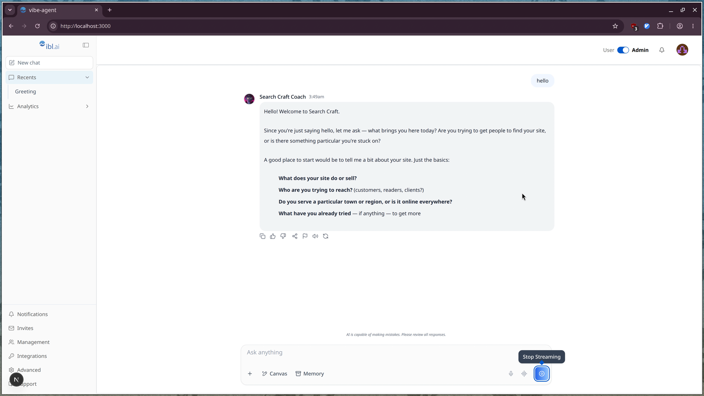

_The coach answers. Owners never pay, whatever the price._

## 6. You, in the app

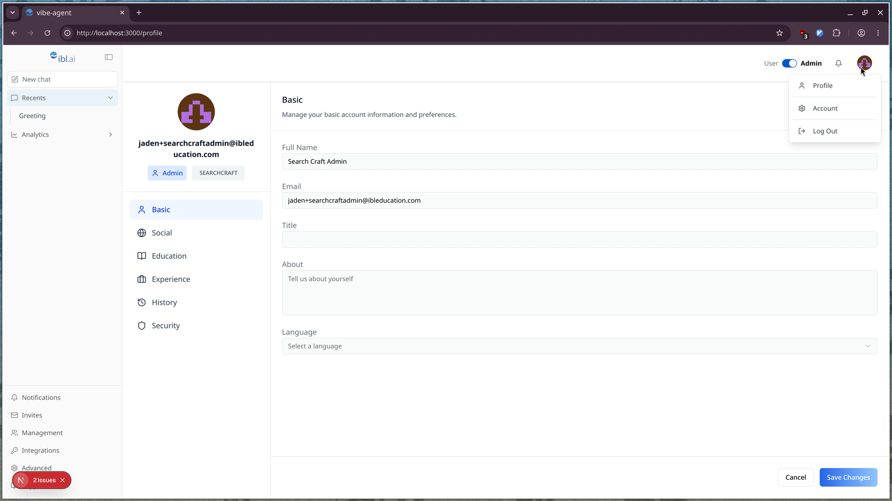

_Top right, your avatar: Profile, Account, Log Out._

**Profile** is you: name, email, a bio if you like. **Account** is your platform: its name, support address, help links and logos.

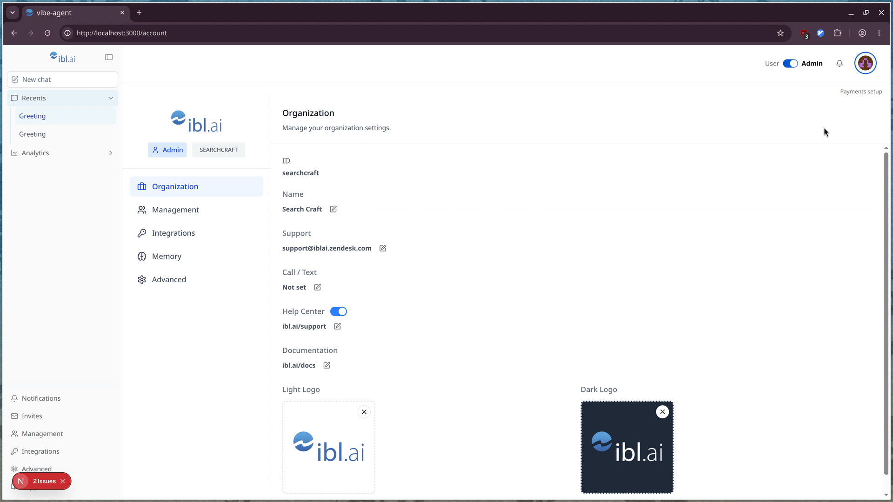

_Organization settings, and the quiet "Payments setup" link at the top right._

That link is how you come back to the setup question: change the price, switch from monthly to one-time, make access free, or Reconnect a different Stripe account. Money changes happen here, in the app — you never ask Claude for them.

## 7. What a customer sees

Give people the address. While you are testing, that is http://localhost:3000, which works only on your computer — so open it yourself in a private (incognito) window and play the customer. After chapter 8 it is the public address.

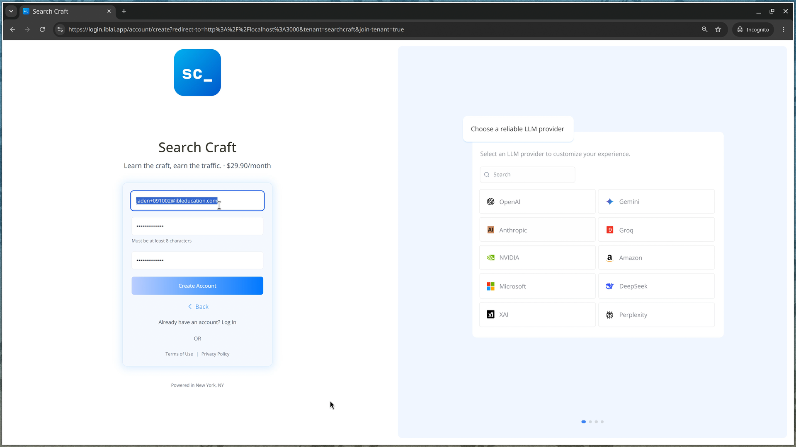

_Your platform's line, with the price after it: "Learn the craft, earn the traffic. · $29.90/month"._

They create an account — an email and a password, or one of the sign-in buttons — or log in with one they have, and arrive in the chat.

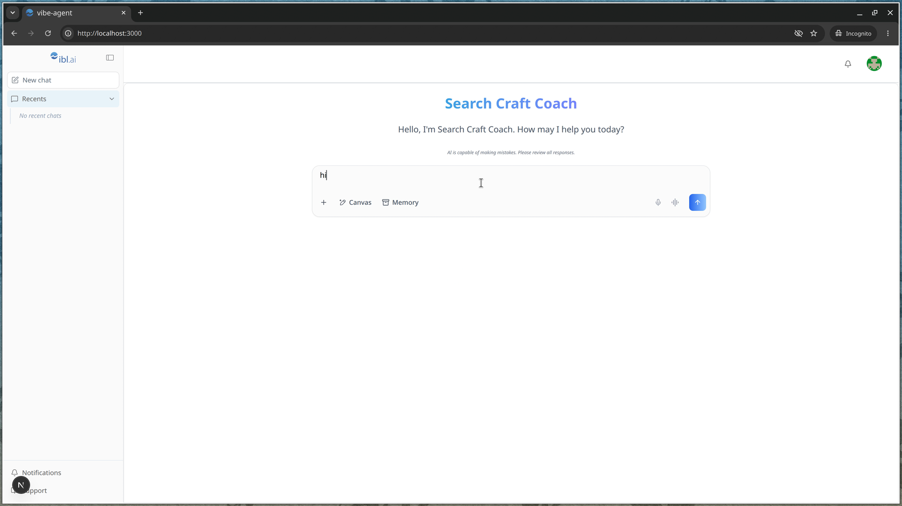

_The customer's view: no Admin switch, no Analytics, no setup question._

Their first message does not go through yet. It opens the payment window:

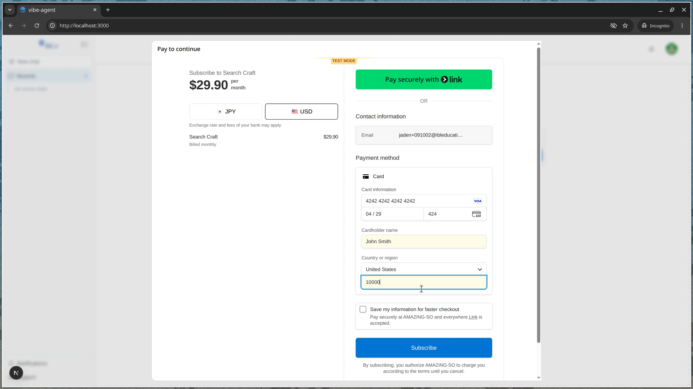

_Stripe's own form, inside your app: the price, the plan, the card. In TEST MODE, card number 4242 4242 4242 4242, any future date, any three digits._

After paying, the window closes, the message is sent, and the agent answers. From then on, they simply chat.


_Paid up. Follow-up questions appear as buttons under the answer._

They have a profile too, marked User:

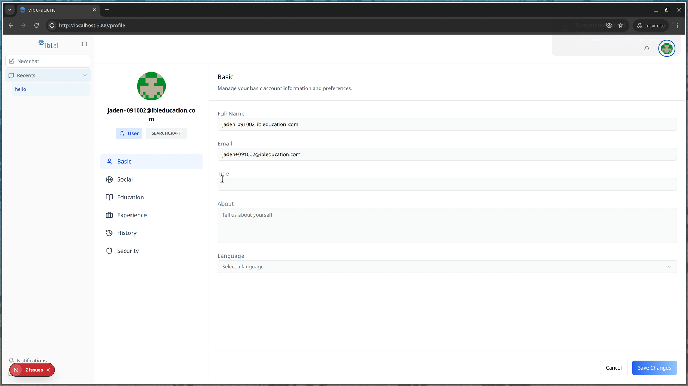

_The same profile page, without the admin's extras._

If a subscription is cancelled, the payment window returns on their next message, within about a minute.

## 8. Put it online

So far the app runs on your computer. To give it a public address:

> **Say to Claude:** `publish it`

Claude asks one thing: the name you want the address to have — `<name>.vercel.app`, lowercase letters, digits and hyphens (Search Craft would be `search-craft`). It publishes the app on ibl.ai hosting and tells you the address. If it says it does not have the publishing skill:

> **Say to Claude:** `install the ibl.ai vibe skills with npx skills add iblai/vibe --all, then publish it`

One thing is left that Claude cannot do. The new address has to be on your platform's list of allowed sign-in addresses (support calls them redirect origins); until it is, signing in at the new address never comes back. Ask ibl.ai support to add it: https://ibl.ai/support. Then open the address in a private window and walk through chapter 7 once, for real.

Share the address. That is your app.

## 9. Later

| You want to                                | Do this                                                                                                         |
| ------------------------------------------ | --------------------------------------------------------------------------------------------------------------- |
| Change the price, make it free, or go paid | In the app: avatar → Account → Payments setup.                                                                  |
| Take real payments instead of test ones    | Payments setup → Reconnect, and connect your live Stripe account.                                               |
| Start the app on your computer again       | Open the terminal where you began, type `claude`, and say `get https://github.com/iblai/vibe-agent and run it`. |
| Publish a change                           | Say `publish it` to Claude.                                                                                     |

## When something looks wrong

| What you see                                                                                 | What it means                                                                                                                                               |
| -------------------------------------------------------------------------------------------- | ----------------------------------------------------------------------------------------------------------------------------------------------------------- |
| Sign-in goes to login.iblai.app and never comes back                                         | The address you are using is not on the platform's allowed list. localhost is fine while testing; a published address has to be added — ask ibl.ai support. |
| "You do not have access to this platform" after signing in                                   | Joining was switched off on the platform. Open Payments setup and press Save once more: every save switches it back on.                                     |
| A customer's first message answers "Permission denied" instead of opening the payment window | Self-service payments are not enabled on the platform yet. Ask ibl.ai support to enable them.                                                               |
| Save fails with a message about Stripe                                                       | Stripe refused the connected account. Press Reconnect, go through Stripe again, then Save.                                                                  |
